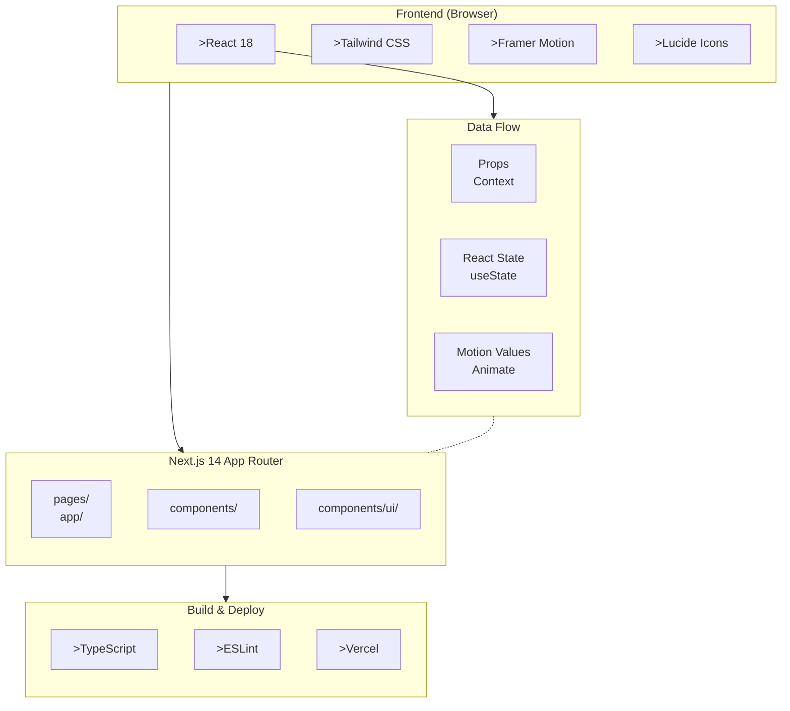

# Streamline Landing Page

<p align="center">
  <a href="https://vercel.com/gileb64375-5584s-projects/v0-streamline-landing-page-p2">
    
  </a>
  <a href="https://v0.app/chat/projects/6Q3PV6LlePg">
    
  </a>
</p>

## Overview

> **Streamline** is a modern, high-performance landing page built with Next.js 14, React 18, and Tailwind CSS. It features stunning animations powered by **Framer Motion**, a sleek dark-themed UI, and interactive components designed to convert visitors into customers.

This project showcases a professional business landing page with:
- 🎯 Interactive ROI Calculator
- 📊 Animated Statistics & Counters
- 💼 Service Cards & Features
- ⭐ Customer Testimonials
- 🚀 Success Stories
- 📞 Contact & Get Started Flows

---

## System Architecture



---

## Tech Stack

| Category | Technology | Version |
|----------|------------|----------|
| **Framework** | Next.js | `14.2.16` |
| **Language** | TypeScript | `^5` |
| **UI Library** | React | `^18` |
| **Styling** | Tailwind CSS | `^3.3.0` |
| **Animations** | Framer Motion | `latest` |
| **Icons** | Lucide React | `^0.454.0` |
| **Package Manager** | pnpm | `latest` |
| **Deployment** | Vercel | `latest` |

---

## Directory Structure

```
streamline-landing-page/
├── app/                          # Next.js App Router
│   ├── contact/                 # Contact page
│   ├── get-started/            # Get Started page
│   ├── globals.css             # Global styles
│   └── layout.tsx               # Root layout
├── components/                  # Main components
│   ├── ui/                     # Reusable UI primitives
│   │   ├── button.tsx          # Button component
│   │   └── theme-provider.tsx  # Theme provider
│   ├── hero.tsx                # Hero section
│   ├── navbar.tsx              # Navigation bar
│   ├── features.tsx           # Features section
│   ├── services.tsx            # Services section
│   ├── testimonials.tsx         # Testimonials
│   ├── success-stories.tsx     # Success stories
│   ├── cta.tsx                 # Call-to-action
│   ├── footer.tsx              # Footer
│   ├── animated-background.tsx
│   ├── animated-button.tsx
│   ├── animated-cubes.tsx
│   ├── background-paths.tsx
│   ├── background-stripes.tsx
│   ├── brand-strategy.tsx
│   ├── business-selector.tsx
│   ├── contact-page.tsx
│   ├── counting-stats.tsx
│   ├── cursor-effect.tsx
│   ├── customer-inquiry.tsx
│   ├── features.tsx
│   ├── get-started-flow.tsx
│   ├── glow-button.tsx
│   ├── glossy-icon.tsx
│   ├── how-we-work.tsx
│   ├── innovative-services.tsx
│   ├── interactive-cta.tsx
│   ├── mouse-move-effect.tsx
│   ├── roi-calculator-home.tsx
│   └── services-page.tsx
├── lib/
│   └── utils.ts                # Utility functions
├── public/                     # Static assets
│   ├── *.png                   # Images
│   └── *.svg                  # SVGs
├── styles/
│   └── globals.css            # Global CSS
├── package.json                # Dependencies
├── tailwind.config.js          # Tailwind config
├── tsconfig.json               # TypeScript config
└── next.config.mjs            # Next.js config
```

---

## Key Features

### Core Features
- **🎨 Modern Dark Theme** — Sleek, professional dark color scheme
- **📱 Fully Responsive** — Mobile-first design that works on all devices
- **⚡ Fast Performance** — Optimized with Next.js App Router
- **♿ Accessible** — Built with accessibility in mind

### Interactive Elements
- **✨ Framer Motion Animations** — Smooth, fluid animations throughout
- **🎯 ROI Calculator** — Interactive calculator to estimate ROI
- **📊 Animated Counters** — Statistics that animate on scroll
- **🖱️ Custom Cursor Effects** — Interactive mouse follow effects
- **🔘 Glow Buttons** — Beautiful hover glow effects

### Sections
1. **Hero Section** — Bold headline with animated background
2. **Features Grid** — Key value propositions
3. **Services** — Business services offered
4. **How We Work** — Process documentation
5. **ROI Calculator** — Interactive business tool
6. **Testimonials** — Customer reviews
7. **Success Stories** — Case studies
8. **Contact CTA** — Call to action
9. **Footer** — Navigation and links

---

## Getting Started

### Prerequisites

> **Ensure you have the following installed:**
- Node.js `18.x` or higher
- pnpm `8.x` or higher
- Git

### Installation

```bash
# 1. Clone the repository
git clone https://github.com/your-repo/streamline-landing-page.git

# 2. Navigate to project directory
cd streamline-landing-page

# 3. Install dependencies
pnpm install

# 4. Start development server
pnpm dev
```

### Development Commands

```bash
# Start development server (hot reload)
pnpm dev

# Build for production
pnpm build

# Start production server
pnpm start

# Run linting
pnpm lint
```

---

## Configuration

### Tailwind Configuration

```javascript
// tailwind.config.js
module.exports = {
  content: [
    './app/**/*.{js,ts,jsx,tsx,mdx}',
    './components/**/*.{js,ts,jsx,tsx,mdx}',
  ],
  theme: {
    extend: {
      // Custom colors, fonts, animations
    },
  },
  plugins: [
    require('tailwindcss-animate'),
  ],
}
```

### Environment Variables

| Variable | Description | Required |
|----------|-------------|----------|
| `NEXT_PUBLIC_API_URL` | API endpoint | No |

### TypeScript Configuration

```json
{
  "compilerOptions": {
    "target": "ES2017",
    "lib": ["dom", "dom.iterable", "esnext"],
    "allowJs": true,
    "skipLibCheck": true,
    "strict": true,
    "noEmit": true,
    "esModuleInterop": true,
    "module": "esnext",
    "moduleResolution": "bundler",
    "resolveJsonModule": true,
    "isolatedModules": true,
    "jsx": "preserve",
    "incremental": true,
    "plugins": [{ "name": "next" }],
    "paths": {
      "@/*": ["./*"]
    }
  },
  "include": ["next-env.d.ts", "**/*.ts", "**/*.tsx", ".next/types/**/*.ts"],
  "exclude": ["node_modules"]
}
```

---

## Project Statistics

| Metric | Value |
|--------|-------|
| **Total Components** | `30+` |
| **Pages** | `3` (Home, Contact, Get Started) |
| **Dependencies** | `14` |
| **Dev Dependencies** | `9` |
| **Lines of Code** | `~2500` |

---

## Deployment

### Vercel Deployment

The project is automatically deployed to Vercel on every push to the main branch.

**Live URL:** **[https://vercel.com/gileb64375-5584s-projects/v0-streamline-landing-page-p2](https://vercel.com/gileb64375-5584s-projects/v0-streamline-landing-page-p2)**

### Manual Deployment

```bash
# Install Vercel CLI
pnpm i -g vercel

# Deploy
vercel

# Deploy to production
vercel --prod
```

---

## Contributing

> **Contributions are welcome!**

1. Fork the repository
2. Create your feature branch (`git checkout -b feature/amazing-feature`)
3. Commit your changes (`git commit -m 'Add some amazing feature'`)
4. Push to the branch (`git push origin feature/amazing-feature`)
5. Open a Pull Request

---

## License

This project is licensed under the **MIT License**.

---

## Support

If you encounter any issues or have questions:
- 📧 Email: support@example.com
- 💬 Discord: [Join our community](https://discord.gg/example)
- 🐛 Issues: [Open an issue](https://github.com/your-repo/streamline-landing-page/issues)

---

<p align="center">
  <strong>Built with ❤️ using <a href="https://v0.app">v0.app</a></strong>
</p>